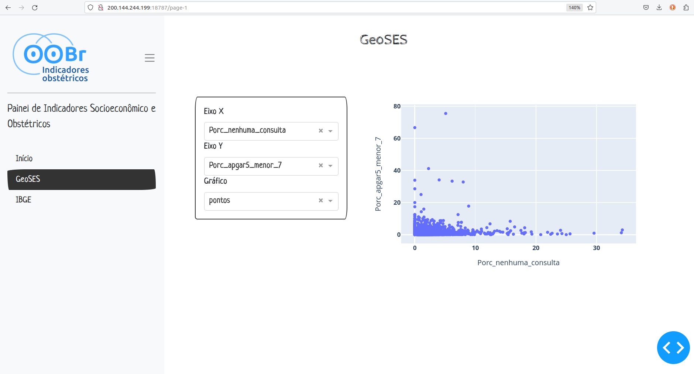

# oobr_produtos_ciencia_dados

Repositório de Prestação de Conta da Atividade de Cientista de Dados
## Chamada MCTI/CNPq/MS/SCTIE/Decit/Fundação Bill & Melinda Gates No 31/2020

Definição dos Indicadores Obstétricos níveis estadual e municipal - pelo método SMART.
1. Definir e documentar processo de coleta de dados relacionados à nascidos vivos e mortalidade nas
bases: SINASC, CNES por meio do PCDaS.
* [Jupyter-Notebook - Procedimentos de Aquisição e Processamento dos Dados](https://github.com/wesleyz/oobr_produtos_ciencia_dados/blob/main/ETL-SIM-SINASC-GeoSES-Polis-ETLCNES-ETLSIH%20-%20OOBr.ipynb)
* [Jupyter-Notebook - Tutorial Geração de Mapas do Brasil](https://github.com/wesleyz/oobr_produtos_ciencia_dados/blob/main/OOBr%20-%20Tutorial%20Gera%C3%A7%C3%A3o%20de%20Mapa%20dos%20Estados%20Brasileiros%20em%20Python.ipynb)
2. Associação das variáveis (Socioeconômicos - IDH, IDHM, Indicadores de desigualdade, Saneamento etc)
para geração de indicadores. Buscar fontes complementares, exemplo: Atlas Brasil -http://www.atlasbrasil.org.br/,
em especial, cobertura de esgoto.
* [Jupyter-Notebook - Processamento dos Dados de Dados Ambientais](https://github.com/wesleyz/oobr_produtos_ciencia_dados/blob/main/Ambientais%20OOBR.ipynb)
3. Descrever os grupos significativos e variáveis potencialmente preditivas.
* [Relatório Variáveis Censo Brasileiro](https://github.com/wesleyz/oobr_produtos_ciencia_dados/blob/main/OOBr_Dados_Socio_Economicos-CENSO.pdf)
* [Relatório Variáveis Geoses](https://github.com/wesleyz/oobr_produtos_ciencia_dados/blob/main/OOBr_Dados_Socio_Economicos-GEOSES.pdf) 
5. Propor formato de relatório interativo (Web Dashboard).
* [Código Fonte](https://github.com/wesleyz/oobr_produtos_ciencia_dados/blob/main/app-geoses-responsive-collapsible-sidebar.zip)
* Inicial: 
6. Acionabilidade e Acessibilidade dos Indicadores: Painel/Dashboard - inspiração o IMAPI (https://imapi.org); API de consulta/consumo de informação.
7. Implantar arquitetura de coleta e processamento automático das informações necessárias aos indicadores.
* A implementação do Item 1 contém o script de aquisição dos dados. Uma vez configurado no agendador de tarefas de um servidor, cumpre a proposição deste tópico. Haja visto que não foi designado formalmente um servidor de internet para configuração do serviço, a tarefa está parcialmente completa. 
8. Implementar arquitetura de compartilhamento de informação dos indicadores por meio de consultas web no formato de API.
* Uma vez configurado no agendador de tarefas de um servidor, cumpre a proposição deste tópico. Haja visto que não foi designado formalmente um servidor de internet para configuração do serviço, a tarefa está parcialmente completa.  
9. Disponibilizar um Painel de Indicadores Interativo, com base no conjunto de informações dos indicadores
estabelecidos.
[Código Fonte](https://github.com/wesleyz/oobr_produtos_ciencia_dados/blob/main/app-geoses-responsive-collapsible-sidebar.zip)
